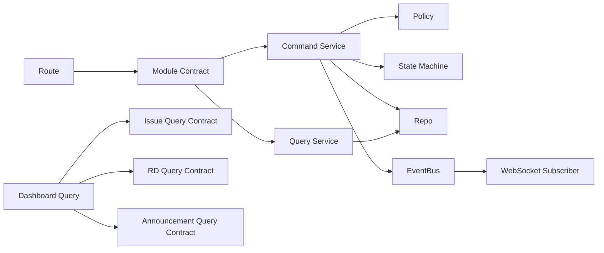

# apps/hub-v2 架构设计文档

最后更新：2026-03-20

## 1. 文档目的

本文档用于定义 `apps/hub-v2` 的目标架构，回答以下问题：

- 系统如何分层
- 模块如何拆分
- 模块之间如何交互
- 哪些能力属于共享基础设施
- 如何保证后续编码不重新回到高耦合单体实现

本文档是 [01-hub-redesign-implementation-plan.md](d:/ng-manager/apps/hub-v2/docs/01-hub-redesign-implementation-plan.md) 的架构展开文档，重点覆盖：

- 分层架构
- 模块依赖方向
- Contract 设计
- RequestContext 设计
- EventBus 机制
- 状态机落地位置
- Query Layer 设计
- 工程装配方式

---

## 2. 架构目标

`apps/hub-v2` 的架构目标不是追求复杂分布式能力，而是在单体部署前提下获得足够清晰的边界和足够稳定的工程结构。

目标如下：

1. 保持单体部署与低运维复杂度
2. 明确模块边界，控制跨模块耦合
3. 让流程型业务具备可执行状态机
4. 让 HTTP、WS、CLI、Job 可以复用同一套业务服务
5. 让 Dashboard 和通知能力建立在只读聚合与事件消费之上
6. 为未来扩展保留空间，但不提前引入复杂框架

---

## 3. 总体架构

### 3.1 逻辑分层

推荐采用五层逻辑结构：

```text
接入层
  HTTP / WebSocket / CLI / Job

应用层
  Route / Context Builder / DTO Mapping / Use Case Entry

领域层
  Command Service / Query Service / Policy / State Machine / Contract

基础设施层
  SQLite / File Storage / EventBus / Auth Adapter / Logging

展示层
  Angular Shell / Features / API Clients / Stores
```

### 3.2 核心原则

1. 单体优先，但边界必须显式
2. 跨模块调用必须通过 Contract
3. 所有业务入口必须构造 `RequestContext`
4. 所有流程型动作必须经过状态机和策略层
5. EventBus 是事件传播中心，WS 只是订阅者
6. Dashboard 只能依赖 Query Layer，不依赖写服务或 repo

---

## 4. 服务端架构

### 4.1 目录结构

建议目录结构如下：

```text
apps/hub-v2/server/src
  app/
    create-app.ts
    register-plugins.ts
    register-routes.ts
    build-container.ts

  shared/
    auth/
    context/
    db/
    errors/
    event/
    http/
    storage/
    utils/

  modules/
    auth/
    user/
    project/
    upload/
    shared-config/
    announcement/
    document/
    release/
    issue/
    rd/
    dashboard/

  db/
    migrations/
```

### 4.2 模块内部结构

每个模块建议包含：

```text
module/
  *.contract.ts
  *.routes.ts
  *.schema.ts
  *.service.ts
  *.repo.ts
  *.types.ts
```

复杂流程模块增加：

```text
  *.policy.ts
  *-state-machine.ts
  *-query.ts
  *-event.service.ts
```

### 4.3 模块职责

基础域：

- `auth`
- `user`
- `project`
- `upload`
- `shared-config`

内容域：

- `announcement`
- `document`
- `release`

协作域：

- `issue`

研发域：

- `rd`

聚合域：

- `dashboard`

---

## 5. 模块依赖设计

### 5.1 依赖方向

推荐依赖方向如下：

```text
routes -> contract -> command/query service -> policy/state machine -> repo
                                         -> event bus
dashboard query -> other modules' query contract
ws subscriber -> event bus -> query contract / notify adapter
```

### 5.2 明确允许的依赖

允许：

- route 依赖 contract
- service 依赖 repo
- service 依赖 policy
- service 依赖 state machine
- service 依赖 event bus
- query 依赖 query contract

### 5.3 明确禁止的依赖

禁止：

- route 直接调用 repo
- dashboard 直接依赖 repo
- module A 直接依赖 module B 的 repo
- service 直接调用 ws manager
- page 直接拼装跨模块后端语义

### 5.4 模块依赖图



---

## 6. Contract 层设计

### 6.1 设计目的

Contract 层用于定义模块对外暴露的稳定能力。

它的作用不是重复 service，而是：

- 固定对外接口
- 隔离实现细节
- 稳定跨模块调用
- 提供 mock 边界

### 6.2 Contract 分类

建议分为两类：

- Command Contract
- Query Contract

示例：

```ts
export interface IssueCommandContract {
  create(input: CreateIssueInput, ctx: RequestContext): Promise<IssueEntity>;
  assign(issueId: string, assigneeId: string, ctx: RequestContext): Promise<IssueEntity>;
  resolve(issueId: string, input: ResolveIssueInput, ctx: RequestContext): Promise<IssueEntity>;
}

export interface IssueQueryContract {
  getDetail(issueId: string, ctx: RequestContext): Promise<IssueDetailResult>;
  list(query: ListIssuesQuery, ctx: RequestContext): Promise<IssueListResult>;
}
```

### 6.3 Contract 约束

1. Contract 不暴露 repo 细节
2. Contract 不暴露 Fastify 类型
3. Contract 必须显式接收 `RequestContext`
4. Contract 返回业务语义对象，而不是 HTTP 响应对象

---

## 7. RequestContext 设计

### 7.1 设计目标

`RequestContext` 是系统统一上下文模型，用于承载：

- 当前账号
- 当前业务用户
- 当前角色集合
- 当前可访问项目范围
- 请求来源与观测信息

### 7.2 推荐定义

```ts
export interface RequestContext {
  accountId: string;
  userId?: string | null;
  roles: string[];
  projectIds?: string[];
  source: 'http' | 'ws' | 'cli' | 'job';
  requestId?: string;
  ip?: string;
  userAgent?: string;
}
```

### 7.3 语义约束

- `accountId`：登录账号标识
- `userId`：业务用户标识，可为空
- `roles`：角色集合
- `projectIds`：当前请求允许访问的项目范围

需要特别区分：

- `projectId`：当前操作的目标项目
- `projectIds`：当前请求允许访问的项目范围

二者不能混用。

### 7.4 构造方式

HTTP：

- 由认证中间件和路由参数共同构造

WS：

- 由握手登录态和订阅范围构造

CLI：

- 由本地配置和调用命令参数构造

Job：

- 由系统账号和任务调度参数构造

### 7.5 使用规则

1. 所有 service 必须接收 `RequestContext`
2. repo 禁止感知 `RequestContext`
3. policy 必须可独立接收 `RequestContext`
4. route 层负责协议对象到 context 的映射

---

## 8. Policy 与状态机

### 8.1 Policy 层职责

Policy 层负责回答：

- 当前用户是否能执行某动作
- 当前用户是否对某项目、某实体有访问权限
- 某个动作是否缺少必要前置条件

### 8.2 状态机职责

状态机负责回答：

- 当前状态是否允许执行某动作
- 动作执行后的下一个状态是什么
- 应触发哪些副作用

### 8.3 推荐关系

```text
Command Service
  -> Policy: can user do this?
  -> State Machine: can status transition?
  -> Repo: persist changes
  -> EventBus: emit side effects
```

### 8.4 Issue 状态机建议

Issue 状态机必须至少定义：

- 状态集合
- 动作集合
- 迁移表
- Guard
- Side Effects

示例：

```ts
export const issueStateMachine = {
  open: { start: 'in_progress', close: 'closed' },
  in_progress: { resolve: 'resolved', close: 'closed' },
  resolved: { verify: 'verified', reopen: 'reopened', close: 'closed' },
  verified: { reopen: 'reopened', close: 'closed' },
  reopened: { start: 'in_progress', close: 'closed' },
  closed: { reopen: 'reopened' }
} as const;
```

### 8.5 RD 状态机建议

RD 状态机同样必须独立定义，不能散落在页面逻辑和 service 条件分支中。

建议动作包括：

- `start`
- `block`
- `resume`
- `finish`
- `accept`
- `close`
- `cancel`
- `update_progress`

---

## 9. EventBus 设计

### 9.1 设计目标

EventBus 是系统内事件传播层，用于解耦：

- 业务动作
- WS 推送
- 通知
- 审计
- 后续读模型刷新

### 9.2 推荐结构

```text
shared/event/
  domain-event.ts
  event-bus.ts
  in-memory-event-bus.ts
```

### 9.3 事件模型

```ts
export interface DomainEvent {
  type: string;
  scope: 'global' | 'project';
  projectId?: string;
  entityType: 'announcement' | 'document' | 'release' | 'issue' | 'rd' | 'system';
  entityId: string;
  action: string;
  actorId?: string;
  occurredAt: string;
  payload?: Record<string, unknown>;
}
```

### 9.4 发布与订阅

发布者：

- IssueCommandService
- RdCommandService
- AnnouncementService
- DocumentService
- ReleaseService

订阅者：

- WebSocket Subscriber
- Notification Subscriber
- Audit Subscriber

### 9.5 规则

1. 业务事实先落库，再发布事件
2. 事件只表达摘要，不承载完整实体
3. WS 只是订阅者，不是业务入口

---

## 10. Query Layer 设计

### 10.1 设计目标

Query Layer 用于承接：

- 跨模块只读聚合
- Dashboard 数据拼装
- 更适合查询语义而非写语义的业务视图

### 10.2 推荐分类

- 模块内 Query Service
- 聚合型 Query Service

示例：

```ts
export interface DashboardQueryContract {
  getHomeData(ctx: RequestContext): Promise<DashboardViewData>;
}
```

### 10.3 Dashboard 约束

Dashboard 只允许依赖：

- IssueQueryContract
- RdQueryContract
- AnnouncementQueryContract
- DocumentQueryContract
- ProjectAccessContract

Dashboard 禁止依赖：

- issue.repo
- rd.repo
- announcement 写 service

### 10.4 读模型原则

1. Query 层只读
2. Query 层不更新业务事实
3. Query 层可做聚合和映射
4. 后续如需投影表，统一由 EventBus 驱动维护

---

## 11. 前端架构

### 11.1 推荐结构

```text
app/
  shell/
  core/
  features/
  shared/
```

### 11.2 职责划分

`shell/`

- 布局
- 顶栏
- 侧边栏
- 项目切换器
- 通知入口

`core/`

- auth
- http
- ws
- guards
- project-context

`features/`

- 按业务域拆分
- 每个 feature 自带 api、types、ui、pages

### 11.3 前端约束

1. `AppComponent` 只负责全局壳
2. 页面不拼装跨域后端逻辑
3. Feature API client 按业务域拆分
4. Dashboard 页面只调用 Dashboard API

---

## 12. 应用装配设计

### 12.1 目标

避免再次出现单一入口装配所有 repo/service 的膨胀结构。

### 12.2 推荐方式

`build-container.ts` 负责：

- 初始化共享基础设施
- 创建模块实现
- 注册 contract 到 container

`create-app.ts` 负责：

- 创建 Fastify 实例
- 注册插件
- 挂载路由

### 12.3 container 示例

```ts
type AppContainer = {
  issueCommand: IssueCommandContract;
  issueQuery: IssueQueryContract;
  rdCommand: RdCommandContract;
  rdQuery: RdQueryContract;
  dashboardQuery: DashboardQueryContract;
  eventBus: EventBus;
};
```

### 12.4 装配原则

1. route 只从 container 取 contract
2. route 不感知 repo
3. container 是实现绑定点，不是业务逻辑承载点

---

## 13. 工程约束

### 13.1 强约束

1. Repo 不允许包含业务逻辑
2. Service / Query 是唯一业务入口
3. 状态机必须集中定义
4. 跨模块调用必须走 Contract
5. EventBus 是事件传播唯一入口
6. 所有业务入口必须构造 `RequestContext`

### 13.2 事务约束

以下动作必须定义事务边界：

- Issue 创建
- Issue 状态迁移
- RD 创建
- RD 状态迁移
- 上传绑定关系写入

推荐模式：

```text
transaction {
  update entity
  update relation
  write log
}
after commit {
  emit event
}
```

### 13.3 测试约束

必须可单测的层：

- state machine
- policy
- contract mock 调用链
- query 聚合逻辑

---

## 14. 架构验收标准

若满足以下条件，则说明 v2 架构达到了可持续开发的最低要求：

1. 模块间无 repo 级跨域依赖
2. 所有写动作都可追踪到 Contract -> Service -> Policy/StateMachine -> Repo
3. 所有业务入口都显式构造 `RequestContext`
4. Dashboard 不承载写逻辑
5. WS 不作为业务事实入口
6. Issue / RD 状态机可独立测试
7. Contract 可被 HTTP、WS、CLI、Job 复用

---

## 15. 后续关联文档

建议配套阅读：

1. [01-hub-redesign-implementation-plan.md](d:/ng-manager/apps/hub-v2/docs/01-hub-redesign-implementation-plan.md)
2. `03-database-design.md`
3. `04-api-design.md`
4. `05-implementation-roadmap.md`
