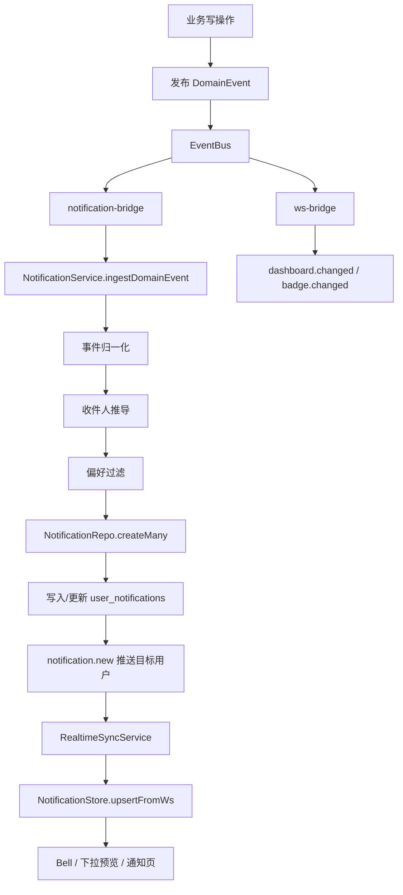

# Hub V2 通知机制

本文档描述 `apps/hub-v2` 当前通知中心的完整实现机制，覆盖通知入库、收件人推导、偏好过滤、去重、未读计数、WebSocket 增量推送、前端 Bell 与通知页状态同步。

第 14 篇 [WS 实时通知机制](/hub-v2/14-ws-realtime-notification) 主要冻结 WebSocket 事件协议和刷新提示职责；本文作为第 18 篇文档，进一步补齐“通知作为业务数据”的端到端设计。

## 1. 目标

通知机制需要满足以下目标：

1. 业务事件发生后，只通知真正相关的人。
2. 操作者本人默认不收到自己触发的通知。
3. Bell 未读数、下拉预览、通知中心列表保持一致。
4. 多端登录时，任一端已读后其他端同步未读数。
5. 同一浏览器切换用户时，不串用上一个用户的通知状态。
6. 高频事件不会无意义刷屏，短时间重复通知需要去重合并。

## 2. 核心模块

服务端：

- `shared/event/EventBus`
- `shared/event/notification-bridge.ts`
- `shared/ws/ws-bridge.ts`
- `shared/ws/ws-hub.ts`
- `modules/notifications/notification.service.ts`
- `modules/notifications/notification.repo.ts`
- `modules/notifications/notification.routes.ts`
- `modules/profile/profile.service.ts`

前端：

- `core/realtime/ws-client.service.ts`
- `core/realtime/realtime-sync.service.ts`
- `features/notifications/store/notification.store.ts`
- `features/notifications/components/notification-bell`
- `features/notifications/components/notification-dropdown`
- `features/notifications/pages/notifications-page`

## 3. 总体链路



说明：

- `notification-bridge` 负责通知数据本体：入库、去重、推送 `notification.new`。
- `ws-bridge` 只负责轻量刷新提示：`dashboard.changed`、`badge.changed`。
- 通知列表不再依赖 `notification.changed + reload` 作为主路径，主路径是 `notification.new` 增量 upsert。

## 4. 数据模型

通知落在单表 `user_notifications`。

关键字段：

| 字段 | 说明 |
| --- | --- |
| `id` | 通知 ID |
| `user_id` | 收件用户 ID |
| `kind` | `todo` 或 `activity` |
| `entity_type` | `issue`、`rd`、`announcement`、`document`、`release`、`project` |
| `entity_id` | 业务实体 ID |
| `action` | 业务动作 |
| `title` | 通知标题 |
| `description` | 通知描述 |
| `source_label` | 来源标签 |
| `project_id` | 项目 ID，可为空 |
| `route` | 前端跳转路径 |
| `unread` | 是否未读 |
| `read_at` | 已读时间 |
| `created_at` | 通知时间 |

核心索引：

- `(user_id, created_at DESC)`：按用户查询通知列表。
- `(user_id, unread, created_at DESC)`：按用户查询未读和未读计数。
- `(user_id, project_id, created_at DESC)`：按用户和项目筛选。
- `(user_id, entity_type, entity_id, action, unread, created_at DESC)`：`todo` 去重查找。
- `(user_id, entity_type, entity_id, kind, unread, created_at DESC)`：`activity` 去重查找。

当前用户规模约 30 人，单表方案足够。后续如用户量或全员通知量明显上升，再考虑拆为 `notification_events` + `notification_receipts`。

## 5. 通知分类

`kind`：

- `todo`：需要用户处理的待办。
- `activity`：与用户相关的动态提醒。

`category`：

- `issue_todo`
- `issue_mention`
- `issue_activity`
- `rd_todo`
- `rd_activity`
- `announcement`
- `document`
- `release`
- `project_member`

`category` 由 `entity_type + kind + action` 推导，用于前端筛选、标签展示和偏好配置。

## 6. 事件归一化

通知服务收到 `DomainEvent` 后先执行归一化：

```text
DomainEvent -> NormalizedNotification
```

归一化结果包含：

- `kind`
- `entityType`
- `entityId`
- `action`
- `title`
- `description`
- `sourceLabel`
- `projectId`
- `route`

### 6.1 Issue

支持的主要动作：

- `assign` / `claim`：待办，通知被指派人。
- `resolve`：归一化为 `verify.pending`，待办，通知报告人和验证人。
- `verify` / `reopen`：动态，通知被指派人。
- `close`：动态，通知报告人、被指派人、验证人。
- `commented`：仅当存在 `mentionedUserIds` 时通知被提及用户。
- `participant.added`：待办，通知新增协作人。
- `branch.completed`：动态，通知测试单负责人。

以下动作不进入通知中心：

- `created`
- `start`
- `updated`
- `attachment.added`
- `attachment.removed`
- `participant.removed`

### 6.2 RD

支持的主要动作：

- `created`：待办，通知执行人。
- `complete`：待办，通知验收人。
- `start` / `block` / `resume` / `accept` / `close` / `advance_stage`：动态，通知创建人、执行人、验收人。

`updated` 不进入通知中心，避免普通编辑造成刷屏。

### 6.3 内容发布

支持：

- `announcement.published`
- `document.published`
- `release.published`

项目范围内容通知项目成员；全局范围内容通知所有 active 用户。

### 6.4 项目成员变更

支持：

- `member.added`
- `member.updated`
- `member.removed`

收件人来自事件 payload 中的目标用户或受影响用户。

## 7. 收件人推导

通知服务按照实体类型和动作推导候选收件人。

### 7.1 Issue 收件人规则

| 动作 | 候选收件人 |
| --- | --- |
| `assign` / `claim` | `assigneeId` |
| `participant.added` | `participantUserIds` / `userId` / `userIds` |
| `verify.pending` | `reporterId` + `verifierId` |
| `verify` / `reopen` | `assigneeId` |
| `branch.completed` | `assigneeId` |
| `commented` | `mentionedUserIds` |
| `close` | `reporterId` + `assigneeId` + `verifierId` |
| 其他状态动态 | `reporterId` + `assigneeId` + `verifierId` |

### 7.2 RD 收件人规则

| 动作 | 候选收件人 |
| --- | --- |
| `created` | `memberIds` / `assigneeId` |
| `complete` | `verifierId` / `reviewerId` |
| 关键流转 | `creatorId` + `memberIds` + `verifierId` |

### 7.3 操作者排除

通知服务会从候选收件人中排除操作者：

```text
actorIds = event.actorId + payload.authorId + payload.creatorId
recipients = recipients - actorIds
```

业务事件发射时必须优先使用 `ctx.userId?.trim() || ctx.accountId` 作为 `actorId`。

原因：

- 收件人字段多数是业务用户 ID，例如 `assigneeId`、`reporterId`、`verifierId`、`memberIds`。
- 如果事件只写 `ctx.accountId`，而收件人是 `userId`，排除逻辑无法命中，用户会收到自己触发的通知。

当前 Issue 与 RD 主链路都应使用 userId 优先的 `actorId`。

## 8. 偏好过滤

收件人推导后，会按用户通知偏好过滤。

渠道开关：

- `channels.inbox`

事件开关：

| 通知分类 | 偏好 key |
| --- | --- |
| `issue_todo` | `issue_todo` |
| `issue_mention` | `issue_mentioned` |
| `issue_activity` | `issue_activity` |
| `rd_todo` | `rd_todo` |
| `rd_activity` | `rd_activity` |
| `announcement` | `announcement_published` |
| `document` | `document_published` |
| `release` | `release_published` |
| `project_member` | `project_member_changed` |

若用户没有保存偏好，服务端使用默认开启策略。

## 9. 入库与去重

通知入库由 `NotificationRepo.createMany()` 完成。

### 9.1 批内去重

同一次事件中如果对同一用户产生重复通知，先在内存中合并。

去重 key：

- `activity`：`userId + entityType + entityId + activity`
- `todo`：`userId + entityType + entityId + action`

保留 `createdAt` 最新的一条。

### 9.2 数据库短窗口去重

写库前查找近期未读通知：

- `todo`：同用户 + 同实体 + 同动作，5 分钟内合并。
- `activity`：同用户 + 同实体，10 分钟内合并。

命中后不是新增一条，而是更新原未读行：

- 更新标题、描述、来源、路由、项目。
- 刷新 `created_at`。
- 保持 `unread = 1`。
- 清空 `read_at`。

只对未读通知合并。用户已读后的新事件仍会生成新通知。

## 10. HTTP API

### 10.1 查询通知

```http
GET /api/admin/notifications
```

参数：

| 参数 | 说明 |
| --- | --- |
| `page` | 页码 |
| `pageSize` | 每页数量 |
| `limit` | 兼容旧 limit 参数 |
| `kind` | `todo` / `activity` |
| `category` | 通知分类 |
| `projectId` | 项目过滤 |
| `keyword` | 标题、描述、项目名、来源搜索 |
| `unreadOnly` | 只看未读 |

返回：

```json
{
  "total": 53,
  "unreadTotal": 13,
  "page": 1,
  "pageSize": 20,
  "items": []
}
```

说明：

- `total` 是当前筛选条件下的总数。
- `unreadTotal` 是当前用户所有未读总数，不受当前筛选条件限制，用于 Bell。

### 10.2 标记已读

```http
POST /api/admin/notifications/read
```

按指定 ID 标记：

```json
{
  "notificationIds": ["noti_xxx"]
}
```

全量标记：

```json
{
  "all": true
}
```

返回：

```json
{
  "updated": 53,
  "unreadCount": 0
}
```

服务端处理完成后，会向当前用户所有在线会话推送 `notification.unread`。

## 11. WebSocket 协议

### 11.1 `notification.new`

服务端在通知入库后，向目标用户推送完整通知项和最新未读数。

```json
{
  "type": "notification.new",
  "ts": "2026-04-21T08:00:00.000Z",
  "projectId": "prj_xxx",
  "payload": {
    "notificationId": "noti_xxx",
    "unreadCount": 14,
    "notification": {
      "id": "noti_xxx",
      "kind": "todo",
      "category": "issue_todo",
      "title": "ISSUE-001",
      "description": "ISSUE-001 · 分配给我的问题",
      "sourceLabel": "测试单",
      "projectName": "核心平台",
      "time": "2026-04-21T08:00:00.000Z",
      "route": "/issues?detail=iss_xxx",
      "unread": true,
      "projectId": "prj_xxx"
    },
    "entityType": "issue",
    "entityId": "iss_xxx",
    "action": "assign"
  }
}
```

### 11.2 `notification.unread`

服务端在标记已读后，向同一用户所有在线会话同步权威未读数。

```json
{
  "type": "notification.unread",
  "ts": "2026-04-21T08:00:00.000Z",
  "payload": {
    "unreadCount": 0
  }
}
```

### 11.3 连接可靠性

客户端连接：

- 入口：`/api/admin/ws`
- 鉴权：JWT Cookie
- 心跳：`system.ping` / `system.pong`
- 重连：指数退避 + 抖动
- 旧 socket 隔离：`onmessage` 先判断当前 socket 身份，非当前 socket 的晚到消息直接丢弃。

## 12. 前端状态机制

### 12.1 Bell 初始化

`NotificationStore` 是 root 单例，因此必须按登录用户隔离状态。

当前规则：

1. 监听 `AuthStore.currentUser()`。
2. 用户变化时清空旧通知、预览、未读数、查询条件。
3. 新用户存在时立即 `loadPreview()`。
4. HTTP 请求记录 `userVersion`，旧用户请求晚返回时不会覆盖新用户状态。

这保证同一台电脑从用户 A 切到用户 B 时，Bell 不会继续显示 A 的未读数。

### 12.2 Bell 下拉

Bell 展开时调用：

```text
NotificationStore.loadPreview()
```

下拉面板显示：

- 最新通知预览。
- 总数。
- 分类 tag。
- 项目名称。
- 相对时间。

样式约束：

- `notification-item__tag` 不允许换行。
- 项目名空间不足时单行省略。

### 12.3 通知页

通知页使用 `NotificationStore.load(query)`。

支持：

- 分类筛选。
- 项目筛选。
- 关键字搜索。
- 只看未读。
- 分页。
- 全部标记已读。

### 12.4 WS 增量消费

`RealtimeSyncService` 处理通知消息：

- `notification.new` -> `NotificationStore.upsertFromWs(...)`
- `notification.unread` -> `NotificationStore.setUnreadCount(...)`
- `notification.changed` -> 兼容旧路径，防抖 reload

`upsertFromWs` 行为：

- 用服务端权威 `unreadCount` 更新 Bell。
- 将通知插入或前置到下拉预览。
- 如果当前在通知页且第一页、且匹配当前查询，则插入或前置到列表。
- 如果当前在通知页但不是第一页，不强行插入，避免破坏分页语义。

## 13. 已读同步

### 13.1 单条已读

点击通知项时：

1. 前端本地乐观标记该通知已读。
2. 调用 `/notifications/read`。
3. 服务端更新数据库。
4. 服务端返回权威 `unreadCount`。
5. 服务端通过 WS 推送 `notification.unread` 给同用户所有在线会话。
6. 前端重新加载预览，通知页若激活则刷新当前页。

### 13.2 全部已读

点击“全部标记已读”时：

1. 前端发送 `{ "all": true }`。
2. 服务端执行：

```sql
UPDATE user_notifications
SET unread = 0, read_at = ?
WHERE user_id = ?
  AND unread = 1
```

3. 服务端返回最新 `unreadCount`。
4. 服务端推送 `notification.unread`。
5. 前端清空未读数并刷新预览和通知页。

注意：全部已读必须由服务端按 `user_id` 全量更新，不能只提交当前页已加载的通知 ID。

## 14. 安全边界

1. 查询通知必须基于 `ctx.userId`。
2. 标记已读必须带 `WHERE user_id = ?`，不能跨用户更新。
3. WS 会话按 `userId` 聚合，`userId` 为空时回退 `accountId`。
4. 旧 WebSocket 消息必须在客户端丢弃，防止账号切换时串数据。
5. 业务事件的 `actorId` 必须与收件人 ID 体系一致，优先使用 `userId`。

## 15. 容量与保留策略

当前用户规模约 30 人，`user_notifications` 单表可接受。

已有控制：

- 收件人大多是定向用户，不是全员广播。
- 短窗口去重减少重复写入。
- 查询有用户维度索引。

仍需关注：

- 表目前按历史累积增长。
- 全局公告、文档、版本发布会按 active 用户扩散。

建议后续补充轻量清理：

- 未读通知不自动删除。
- 已读通知保留 90 天。
- 每用户最多保留最近 1000 条已读通知。

## 16. 回归检查清单

每次改通知机制后，至少检查以下场景：

1. 用户 A 登录，Bell 数量正确。
2. 同一浏览器退出 A 登录 B，Bell 立即变为 B 的数量。
3. Issue 指派他人，操作者自己不收到通知。
4. Issue 评论 @ 用户，只通知被 @ 用户，不通知未提及用户。
5. RD 流转时，操作者本人不收到自己触发的通知。
6. 点击 Bell 下拉，列表和未读数不跳回旧用户数据。
7. 点击单条通知，Bell 减少且多端同步。
8. 点击“全部标记已读”，Bell 变为 0，不会只清当前页。
9. 用户关闭 `channels.inbox` 后，通知列表为空且不再入库新通知。
10. 用户关闭某事件偏好后，不再收到对应分类通知。

## 17. 常见问题定位

### 17.1 自己操作后收到通知

优先检查：

- 业务事件 `actorId` 是否使用 `ctx.userId?.trim() || ctx.accountId`。
- payload 中收件人字段是否是 `userId`。
- `NotificationService.collectActorCandidateIds()` 是否能收集到操作者 ID。

### 17.2 Bell 数量与通知页不一致

优先检查：

- `/notifications` 返回的 `unreadTotal`。
- `/notifications/read` 返回的 `unreadCount`。
- 是否收到 `notification.unread`。
- `NotificationStore` 是否被旧用户请求或旧 WS 消息覆盖。

### 17.3 全部已读后仍显示未读

优先检查：

- 前端是否发送 `{ all: true }`。
- 后端是否执行 `markAllRead()`。
- WS 是否向当前用户推送 `notification.unread`。
- 前端是否重新加载预览和当前通知页。

### 17.4 下拉通知样式异常

优先检查：

- `.notification-item__tag` 是否有 `white-space: nowrap`。
- `.notification-item__tag` 是否有 `flex: 0 0 auto`。
- `.notification-item__project` 是否允许单行省略。

## 18. 相关文件

服务端：

- `apps/hub-v2/server/src/modules/notifications/notification.service.ts`
- `apps/hub-v2/server/src/modules/notifications/notification.repo.ts`
- `apps/hub-v2/server/src/modules/notifications/notification.routes.ts`
- `apps/hub-v2/server/src/modules/notifications/notification.types.ts`
- `apps/hub-v2/server/src/shared/event/notification-bridge.ts`
- `apps/hub-v2/server/src/shared/ws/ws-bridge.ts`
- `apps/hub-v2/server/src/shared/ws/ws-hub.ts`
- `apps/hub-v2/server/src/shared/ws/ws.plugin.ts`

前端：

- `apps/hub-v2/web/src/app/core/realtime/ws-client.service.ts`
- `apps/hub-v2/web/src/app/core/realtime/realtime-sync.service.ts`
- `apps/hub-v2/web/src/app/features/notifications/store/notification.store.ts`
- `apps/hub-v2/web/src/app/features/notifications/services/notification-api.service.ts`
- `apps/hub-v2/web/src/app/features/notifications/components/notification-bell/notification-bell.component.ts`
- `apps/hub-v2/web/src/app/features/notifications/components/notification-dropdown/notification-dropdown.component.ts`
- `apps/hub-v2/web/src/app/features/notifications/pages/notifications-page/notifications-page.component.ts`

数据库：

- `apps/hub-v2/server/src/db/migrations/0019_user_notifications.sql`
- `apps/hub-v2/server/src/db/migrations/0020_user_notifications_dedupe_index.sql`
- `apps/hub-v2/server/src/db/migrations/0021_user_notifications_activity_dedupe_index.sql`

